# Diagramme Entité-Relation (ER) — Base de Données MLAcademy

Voici le modèle de données de la plateforme MLAcademy. Le diagramme est structuré par domaines fonctionnels (Authentification & Profils, Catalogue & Cours, Progression & Évaluation, Communauté & Carrière).

## Diagramme Mermaid (UML / ERD)

```mermaid
erDiagram
    %% --- AUTH & USERS ---
    CustomUser {
        int id PK
        string email UK
        string username
        string password
        bool email_verified
        uuid verification_token
        bool otp_enabled
        bool is_instructor
        bool is_recruiter
        bool is_mentor
        string bio
        string avatar
        string linkedin_url
        string github_url
        string portfolio_url
        string level
        string personal_goals
        bool is_public_profile
        int xp_points
    }

    StudentProfile {
        int id PK
        int user_id FK
        string phone
        string gender
        string address_street
        string address_zip
        string address_city
        string address_country
        string french_level
        string english_level
        string current_situation
        json professional_experiences
        json work_permits
        json specific_statuses
        json diplomas
        int hours_per_week
        date desired_start_date
        bool onboarding_completed
        bool honor_declaration_accepted
        string selected_training_slug
        string funding_method
    }

    InstructorApplication {
        int id PK
        int user_id FK
        string cv_url
        string cv_file
        string linkedin_url
        string portfolio_url
        string website_url
        string motivation
        string expertise
        string expertise_detail
        string teaching_experience
        string status
        string rejection_reason
        int reviewed_by_id FK
        datetime submitted_at
        datetime reviewed_at
    }

    Notification {
        int id PK
        int user_id FK
        string type
        string title
        string content
        string link
        bool is_read
        datetime created_at
    }

    Message {
        int id PK
        int sender_id FK
        int recipient_id FK
        string subject
        string body
        bool is_read
        datetime created_at
    }

    %% --- COURSES ---
    CourseCategory {
        int id PK
        string name UK
        string slug
        string icon
        string description
    }

    LearningPath {
        int id PK
        string title
        string slug
        string short_description
        string description
        int category_id FK
        int creator_id FK
        string level
        string thumbnail
        int estimated_weeks
        bool is_published
        bool is_certifying
        bool is_free
        decimal price
        int enrolled_count
        decimal avg_rating
        int courses_count
    }

    Course {
        int id PK
        string title
        string slug
        string short_description
        string description
        int category_id FK
        int instructor_id FK
        string level
        int duration_hours
        string thumbnail
        string preview_url
        string prerequisites_text
        string syllabus
        bool is_published
        bool is_free
        bool is_standalone
        decimal price
        decimal avg_rating
        int enrolled_count
    }

    LearningPathCourse {
        int id PK
        int learning_path_id FK
        int course_id FK
        int order
        bool is_required
    }

    CoursePrerequisite {
        int id PK
        int course_id FK
        int required_course_id FK
    }

    Module {
        int id PK
        string title
        string slug
        string description
        int category_id FK
        int author_id FK
        decimal estimated_hours
        bool is_published
    }

    CourseModule {
        int id PK
        int course_id FK
        int module_id FK
        int order
    }

    Lesson {
        int id PK
        int module_id FK
        string title
        string lesson_type
        string content
        string video_url
        int duration_minutes
        int order
        bool is_free_preview
        string starter_code
        string solution_code
    }

    LessonAttachment {
        int id PK
        int lesson_id FK
        string title
        string file
    }

    Project {
        int id PK
        int module_id FK
        string title
        string description
        string instructions
        string starter_code
        string solution_code
        bool is_final
        bool is_capstone
        int passing_score
    }

    CertificationExam {
        int id PK
        int learning_path_id FK
        string title
        string instructions
        int duration_minutes
        int passing_score
        int max_attempts_per_week
        int capstone_project_id FK
        bool is_published
    }

    CourseReview {
        int id PK
        int course_id FK
        int user_id FK
        int rating
        string comment
    }

    %% --- LEARNING & PROGRESS ---
    Enrollment {
        int id PK
        int user_id FK
        int course_id FK
        datetime enrolled_at
        int progress_percentage
        bool is_completed
        datetime completed_at
    }

    PathEnrollment {
        int id PK
        int user_id FK
        int learning_path_id FK
        datetime enrolled_at
        int progress_percentage
        bool is_completed
        datetime completed_at
        bool is_certified
    }

    UserLessonProgress {
        int id PK
        int user_id FK
        int lesson_id FK
        bool is_completed
        int last_watched_position
        bool is_featured_in_portfolio
    }

    UserNote {
        int id PK
        int user_id FK
        int lesson_id FK
        string content
        int video_timecode
        bool is_featured_in_portfolio
    }

    QuizQuestion {
        int id PK
        int lesson_id FK
        string text
        string explanation
        int order
    }

    QuizChoice {
        int id PK
        int question_id FK
        string text
        bool is_correct
    }

    UserQuizAttempt {
        int id PK
        int user_id FK
        int lesson_id FK
        int score
        bool passed
        datetime created_at
    }

    UserCodeSubmission {
        int id PK
        int user_id FK
        int lesson_id FK
        string code
        json last_result
        bool is_featured_in_portfolio
    }

    ProjectSubmission {
        int id PK
        int user_id FK
        int project_id FK
        string repo_url
        string code_content
        string status
        datetime submitted_at
        bool is_featured_in_portfolio
    }

    ProjectPeerReview {
        int id PK
        int reviewer_id FK
        int submission_id FK
        int score
        string feedback
        bool is_approved
    }

    CertificationExamAttempt {
        int id PK
        int user_id FK
        int exam_id FK
        int score
        bool passed
        datetime started_at
        datetime completed_at
    }

    Certificate {
        int id PK
        int user_id FK
        int course_id FK
        int learning_path_id FK
        string cert_type
        datetime issued_at
        string certificate_id UK
        int final_score
        string pdf_file
    }

    SkillBadge {
        int id PK
        string name
        string icon
        string badge_type
        string description
    }

    UserBadge {
        int id PK
        int user_id FK
        int badge_id FK
        datetime granted_at
        int granted_by_id FK
    }

    %% --- COMMUNITY & JOBS ---
    CommunityCategory {
        int id PK
        string name
        int order
    }

    Company {
        int id PK
        string name
        string description
        string website
        string logo
        string location
        bool is_verified
    }

    JobOffer {
        int id PK
        int company_id FK
        string title
        string description
        string requirements
        string location
        string contract_type
        string salary_range
        bool is_active
        datetime posted_at
        date deadline
    }

    JobApplication {
        int id PK
        int user_id FK
        int job_id FK
        string cover_letter
        string cv_url
        string status
        datetime applied_at
    }

    Channel {
        int id PK
        int category_id FK
        string name
        string description
        string icon
        int order
        bool is_private
    }

    ChannelMessage {
        int id PK
        int channel_id FK
        int user_id FK
        string content
        int parent_id FK
        bool is_pinned
        datetime created_at
    }

    MentorshipRelation {
        int id PK
        int mentor_id FK
        int student_id FK
        string status
        datetime created_at
    }

    SponsoredChallenge {
        int id PK
        int company_id FK
        string title
        string description
        string reward
        bool is_active
        date deadline
    }

    %% --- RELATIONSHIPS ---
    CustomUser ||--o| StudentProfile : "has profile"
    CustomUser ||--o| InstructorApplication : "submits"
    CustomUser ||--o{ Notification : "receives"
    CustomUser ||--o{ Message : "sends/receives"
    
    LearningPath }|--|| CourseCategory : "categorized by"
    LearningPath ||--o{ LearningPathCourse : "contains"
    Course ||--o{ LearningPathCourse : "associated with"
    Course }|--|| CourseCategory : "categorized by"
    CoursePrerequisite }|--|| Course : "prerequisite for / requires"

    Course ||--o{ CourseModule : "contains"
    Module ||--o{ CourseModule : "associated with"
    Module }|--|| CourseCategory : "categorized by"
    Module ||--o{ Lesson : "contains"
    Module ||--o| Project : "concludes with"
    
    Lesson ||--o{ LessonAttachment : "has resources"
    Lesson ||--o{ QuizQuestion : "assessed by"
    QuizQuestion ||--o{ QuizChoice : "has choices"

    %% Progès & Évaluation
    CustomUser ||--o{ Enrollment : "enrolled in course"
    Course ||--o{ Enrollment : "has student"
    CustomUser ||--o{ PathEnrollment : "enrolled in path"
    LearningPath ||--o{ PathEnrollment : "has student"
    
    CustomUser ||--o{ UserLessonProgress : "tracks"
    Lesson ||--o{ UserLessonProgress : "tracked in"
    CustomUser ||--o{ UserNote : "writes"
    Lesson ||--o{ UserNote : "annotated in"
    
    CustomUser ||--o{ UserQuizAttempt : "attempts"
    Lesson ||--o{ UserQuizAttempt : "attempts quiz for"
    CustomUser ||--o{ UserCodeSubmission : "submits"
    Lesson ||--o{ UserCodeSubmission : "runs code for"
    
    CustomUser ||--o{ ProjectSubmission : "submits project"
    Project ||--o{ ProjectSubmission : "requires project"
    CustomUser ||--o{ ProjectPeerReview : "reviews"
    ProjectSubmission ||--o{ ProjectPeerReview : "evaluated by"

    LearningPath ||--o| CertificationExam : "concludes with"
    CustomUser ||--o{ CertificationExamAttempt : "attempts exam"
    CertificationExam ||--o{ CertificationExamAttempt : "evaluated by"
    
    CustomUser ||--o{ Certificate : "holds"
    Course ||--o{ Certificate : "attests completion"
    LearningPath ||--o{ Certificate : "certifies completion"

    CustomUser ||--o{ UserBadge : "earns"
    SkillBadge ||--o{ UserBadge : "defines"

    %% Communauté & Jobs
    Channel }|--|| CommunityCategory : "grouped under"
    ChannelMessage }|--|| Channel : "posted in"
    CustomUser ||--o{ ChannelMessage : "writes"
    ChannelMessage ||--o{ ChannelMessage : "replies to"

    Company ||--o{ JobOffer : "posts"
    CustomUser ||--o{ JobApplication : "applies"
    JobOffer ||--o{ JobApplication : "receives"
    
    CustomUser ||--o{ MentorshipRelation : "participates in"
    Company ||--o{ SponsoredChallenge : "sponsors"
```

## Description des Relations Clés

### 1. Structure Réutilisable des Cours (CMS)
- **Le problème résolu** : Un même module de cours (ex: "Bases de Python") peut être réutilisé dans plusieurs cours différents.
- **La solution** : Au lieu d'associer directement `Lesson` à `Course`, la structure utilise :
  - `CourseModule` (Table de jonction ordonnée entre `Course` et `Module`).
  - `Lesson` est rattachée à un `Module`. Ainsi, toute modification de leçon met à jour tous les cours partageant ce module.

### 2. Le Système d'Évaluation Hybride
- **Quiz Théorique** : Chaque `Lesson` peut avoir plusieurs `QuizQuestion`, qui ont des `QuizChoice`. Les tentatives sont historisées dans `UserQuizAttempt`.
- **Exercice Pratique** : Un étudiant soumet du code évalué en Sandbox (`UserCodeSubmission`).
- **Projet Final** : Clôture un module (`Project`). Il est soumis (`ProjectSubmission`) puis évalué par des pairs (`ProjectPeerReview`).

### 3. Le Processus de Certification
- **Attestation de suivi (Course)** : Délivrée automatiquement quand `Enrollment.progress_percentage` atteint 100% (leçons terminées) et que tous les projets du cours sont validés.
- **Certification Professionnelle (LearningPath)** : L'étudiant doit compléter tous les cours obligatoires du parcours, puis valider soit un projet Capstone (`Project` marqué `is_capstone`), soit réussir l'examen de certification (`CertificationExamAttempt`).
